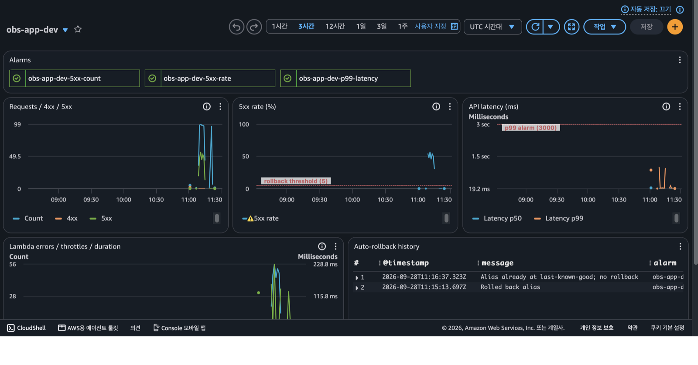

# AWS 서버리스 관측성 및 자가복구 시스템

[](https://github.com/dodongwon/aws-self-healing-observability/actions/workflows/deploy.yml)

배포 결함으로 API 에러율이 급증하면 **운영자 개입 없이 직전 정상 버전으로 자동 롤백**하는 서버리스 시스템입니다.
로그·메트릭·트레이스 기반 관측성, Terraform 기반 인프라 자동화, Access Key를 저장하지 않는 CI/CD(GitHub OIDC)를 함께 구현했습니다.

| 항목 | 결과 |
|---|---|
| 장애 탐지 시간 (MTTD, 결함 배포 → 알람 발생) | **5분 37초** |
| 자동 복구 시간 (MTTR, 결함 배포 → 롤백 완료) | **5분 38초** (알람 발생 후 롤백까지 1.3초) |
| 월 운영 비용 | **약 1,600 ~ 5,800원** (무료 티어 미적용 기준) |
| CI/CD에 저장된 Access Key | **0개** (GitHub OIDC 임시 자격증명 사용) |
| 인프라 코드화 | 전체 44개 리소스를 Terraform으로 관리 |

---

## 1. 문제 정의

소규모 서비스는 장애를 사용자 제보로 인지하고, 로그를 수동으로 확인한 뒤, 운영자가 직접 재배포하는 방식으로 복구합니다. 이 과정에는 **탐지 지연, 진단 지연, 복구 지연**이 모두 존재하며, 운영자가 대응할 수 없는 시간대에는 장애가 장시간 지속됩니다.

본 프로젝트는 세 단계를 모두 자동화하는 것을 목표로 합니다.

| 단계 | 기존 방식 | 본 시스템 |
|---|---|---|
| 탐지 | 사용자 제보 | CloudWatch 알람 (1분 단위 메트릭) |
| 진단 | 서버 접속 후 로그 확인 | 대시보드, 구조화 로그, X-Ray 트레이스 |
| 복구 | 운영자 수동 재배포 | 복구 Lambda가 별칭을 정상 버전으로 전환 |

## 2. 아키텍처

```
  Pull Request ─▶ ci.yml     : 정적 검사 · 단위 테스트 · terraform plan → PR 코멘트
  main 병합    ─▶ deploy.yml : terraform apply → 새 버전 게시 → 해당 버전 검증 → 트래픽 전환

┌────────┐   ┌──────────────┐   ┌───────────────────┐   ┌──────────┐
│ Client │──▶│ API Gateway  │──▶│ Lambda (live 별칭) │──▶│ DynamoDB │
└────────┘   │  (HTTP API)  │   └─────────┬─────────┘   └──────────┘
             └──────┬───────┘             │ 구조화 로그 · EMF 메트릭 · X-Ray
                    ▼                     ▼
             ┌──────────────────────────────────────┐
             │  CloudWatch Logs · Metrics · Dashboard │
             └───────────────────┬──────────────────┘
                                 ▼
             ① 5xx 비율 (롤백용)   ② 5xx 건수 · ③ p99 지연 (알림용)
                      │                       │
                      ▼                       ▼
                 EventBridge              SNS → 이메일
                      ▼
          복구 Lambda ─▶ live 별칭을 검증된 마지막 버전으로 전환
```

## 3. 자가복구 검증 결과

요청의 50%를 실패시키는 결함 버전을 의도적으로 배포하고(`scripts/chaos.sh`), 복구 과정을 측정했습니다.

| 이벤트 (2026-09-28 UTC) | 시각 | 결함 배포 후 경과 |
|---|---|---|
| 결함 버전 v3 배포 | 11:09:35 | 0초 |
| 알림용 알람 발생 | 11:11:19 | 1분 44초 |
| 롤백용 알람 발생 | 11:15:12 | 5분 37초 |
| 복구 Lambda가 v3 → v2 전환 | 11:15:13 | 5분 38초 |

- 결함 구간 5xx 비율 약 50% (500건 중 256건), 복구 후 재부하 144건 중 5xx 0건
- 동일 알람 이벤트 재수신 시 추가 롤백 없음 (멱등성)
- 복구 시간의 대부분은 오탐 방지를 위한 판정 대기(5분 × 2회)이며, 판정 이후 조치는 1.3초 내 완료




## 4. 핵심 설계

| 설계 | 내용 | 효과 |
|---|---|---|
| 버전·별칭 배포 | 배포마다 변경 불가능한 Lambda 버전을 만들고, API는 특정 버전을 가리키는 `live` 별칭만 호출 | 롤백 시 재배포 없이 별칭이 가리키는 버전만 변경 |
| 검증된 롤백 대상 | 검증을 통과한 버전만 `last-known-good`으로 기록 | 단순 이전 버전이 아닌 정상 확인된 버전으로 복귀 |
| 알람 이원화 | 자동 조치 알람은 보수적으로(요청 10건 이상, 5% 초과, 2회 연속), 알림 알람은 민감하게(5xx 3건 이상) | 저트래픽 오탐 롤백과 장애 미탐지를 동시에 방지 |
| 사전 검증 배포 | 새 버전을 직접 호출해 검증한 뒤에만 트래픽 전환 | 결함 버전이 사용자 요청을 받기 전에 차단 |
| 소유권 분리 | 인프라는 Terraform, 코드와 별칭 버전은 CI와 복구 Lambda가 관리 (`ignore_changes`) | `terraform apply`가 자동 롤백을 되돌리지 않음 |
| 중복 실행 방지 (멱등성) | 현재 버전이 목표 버전과 같으면 조치하지 않음 | 같은 알람 이벤트가 여러 번 와도 롤백은 1회만 수행 |
| 알림 경로 독립 | 모든 알람이 SNS로 직접 통보 | 복구 Lambda 장애 시에도 운영자 통보 보장 |

## 5. 기술 스택

| 영역 | 기술 | 선택 이유 |
|---|---|---|
| IaC | Terraform 1.16, AWS Provider 6.x | 모듈 4개(app, api, monitoring, notification)로 분리, S3 네이티브 락으로 락 테이블 제거 |
| 컴퓨팅 | AWS Lambda (Python 3.12, arm64) | 버전·별칭 기반 즉시 롤백, 사용량 과금, Graviton 단가 절감 |
| API | API Gateway HTTP API | REST API 대비 요청 단가 약 70% 저렴, 스테이지 단위 스로틀링 |
| 데이터 | DynamoDB (On-Demand) | 서버 관리 불필요, 저트래픽 시 비용 사실상 0 |
| 관측성 | CloudWatch Logs · Metrics · Alarms · Dashboard, AWS X-Ray | 로그·메트릭·트레이스 3요소 통합 |
| 계측 | Powertools for AWS Lambda (Logger, Metrics, Tracer) | JSON 로그, 커스텀 메트릭(EMF: 로그에 메트릭을 함께 기록), 트레이스를 하나의 라이브러리로 구현 |
| 자가복구 | EventBridge, Lambda, SSM Parameter Store | 알람 상태 변화 이벤트 기반 자동 조치 |
| 알림·비용 통제 | Amazon SNS, AWS Budgets | 장애 통보, 월 예산 초과 경보 |
| CI/CD | GitHub Actions, OIDC | 장기 Access Key 없이 배포, PR 단위 인프라 변경 검토 |
| 테스트 | pytest, moto, ruff | AWS 모킹 기반 단위 테스트, 정적 검사 |

## 6. 비용 설계

평상시 트래픽(월 10만 건) 기준 **월 약 $1.1 ~ $4.1 (약 1,600 ~ 5,800원)** 으로 운영됩니다. 동일 기능을 EC2와 ALB로 구성하면 월 약 3.6만원이 고정 발생합니다.

| 절감 방식 | 비교 대상 | 절감 효과 |
|---|---|---|
| 서버리스 사용량 과금 | EC2 t3.micro + ALB 상시 운영 | 월 약 3.6만원 고정비 제거 |
| VPC 미사용 | NAT Gateway | 월 약 6만원 고정비 회피 |
| HTTP API | REST API | 요청 단가 약 70% 절감 |
| Lambda arm64 | x86_64 | 실행 단가 약 20% 절감 |
| 로그 보존 14일, X-Ray 기본 샘플링 | 무제한 보존, 전수 추적 | 저장·트레이스 비용 누적 방지 |
| API 스로틀링 10 rps, AWS Budgets 경보 | 제한 없음 | 비정상 트래픽으로 인한 과금 상한 통제 |

※ 서울 리전 공개 요금 기준 근사치, 환율 1달러 = 1,400원 가정

## 7. 보안 설계

- **Access Key 미저장**: GitHub Actions는 배포할 때마다 OIDC로 1시간짜리 임시 자격증명을 발급받습니다. 유출될 수 있는 장기 키가 존재하지 않습니다.
- **신뢰 조건 강화**: AWS가 신뢰하는 대상을 레포 이름이 아닌 GitHub 계정·레포의 고유 숫자 ID로 지정했습니다. 레포가 삭제된 뒤 같은 이름으로 다시 만들어져도 권한을 얻을 수 없습니다.
- **역할 분리**: plan 역할(읽기 전용, PR에서만), deploy 역할(`obs-app-*` 리소스만, main 브랜치에서만), 복구 역할(대상 별칭 1개만)로 권한을 나눴습니다.
- **입력 검증**: 요청 본문 형식과 크기(10KB)를 검증하고, 오류 응답에 요청 ID를 포함해 로그와 연결합니다.

## 8. 저장소 구조

```
bootstrap/          Terraform state 버킷, GitHub OIDC Provider, CI용 IAM 역할
infra/modules/      app · api · monitoring · notification
infra/envs/dev/     dev 환경 구성
src/app/            비즈니스 API Lambda
src/remediation/    자동 롤백 Lambda
tests/              단위 테스트 (12건)
scripts/            배포(deploy_app.sh), 부하 생성(load.sh), 장애 주입(chaos.sh)
docs/               시스템 분석·설계서
```

## 9. 상세 문서

[시스템 분석·설계서](docs/시스템분석설계서.md) — 요구사항 명세, 타당성 분석, 상세 설계, 비용 분석, 위험 분석, 테스트 결과
