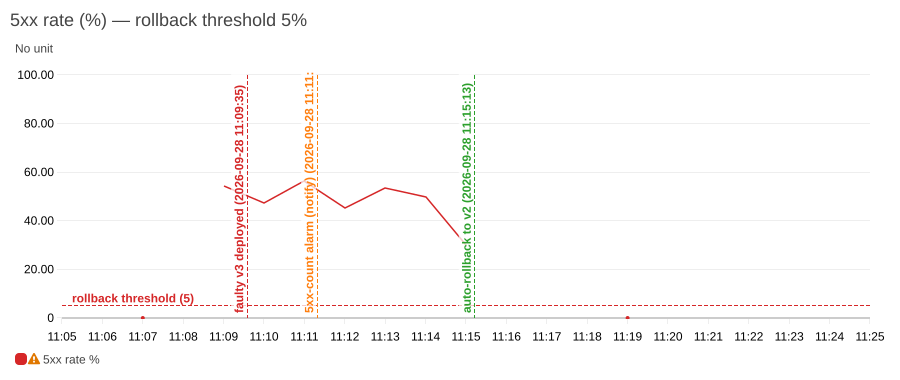
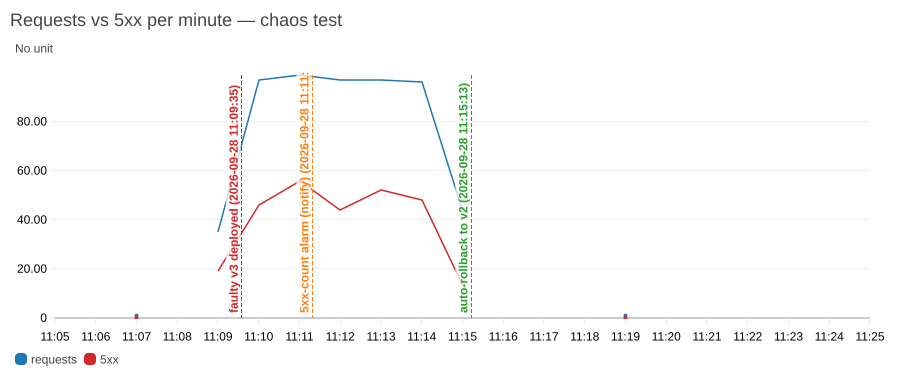

# AWS 서버리스 관측성 & 자가복구 시스템

서버리스 API에 **로그·메트릭·트레이스** 기반 관측성을 구축하고, 배포 결함으로 에러율이 급증하면 **사람 개입 없이 이전 정상 버전으로 자동 롤백**하는 시스템입니다. 전체 인프라는 Terraform으로, 배포는 GitHub Actions + OIDC로 자동화했습니다.

[](https://github.com/dodongwon/aws-self-healing-observability/actions/workflows/deploy.yml)

## 핵심 결과

장애 주입 테스트(`scripts/chaos.sh`)로 요청의 50%가 실패하는 결함 버전을 배포한 뒤, 사람 개입 없이 복구되기까지를 측정했습니다.

| 이벤트 (2026-09-28, UTC) | 시각 | 결함 배포 후 경과 |
|---|---|---|
| 결함 버전 v3 배포 (`FAULT_RATE=0.5`) | 11:09:35 | 0s |
| 알림 알람 `5xx-count` 발생 → 이메일 | 11:11:19.6 | 1분 44초 |
| 롤백 알람 `5xx-rate` 발생 | 11:15:12.4 | **5분 37초 (MTTD)** |
| 복구 Lambda가 `live` 별칭을 v3 → v2로 전환 | 11:15:13.7 | **5분 38초 (MTTR)** |

- 알람 발생 → 롤백 완료까지 **1.3초** — 복구 시간의 대부분은 오탐 방지를 위한 "5분 × 2회 연속" 판정 대기
- 민감한 알림 알람이 1분 44초 만에 먼저 사람에게 알리고, 보수적인 롤백 알람이 확신을 얻은 뒤 자동 조치 — 알람 이원화 설계가 의도대로 동작
- 목표(NFR-02: 10분 이내 자동 복구) 충족, 같은 알람 이벤트 재전송 시 `noop` (멱등성 확인)
- 결함 버전에서 5xx 비율 약 50% (요청 500건 중 256건) → 복구 후 재부하 144건 중 5xx **0건** (재부하는 직후 CI가 같은 코드로 배포한 v4에서 수행)





## 아키텍처

```
  GitHub PR ──▶ ci.yml   : ruff · pytest · terraform plan → PR 코멘트 (읽기 전용 Role)
  main merge ─▶ deploy.yml: terraform apply → 새 버전 게시 → 해당 버전 스모크 테스트 → live 별칭 전환
                                   │
┌────────┐   ┌──────────────┐   ┌──────────────────┐   ┌──────────┐
│ Client │──▶│ API Gateway  │──▶│ Lambda:live 별칭  │──▶│ DynamoDB │
└────────┘   │  (HTTP API)  │   └────────┬─────────┘   └──────────┘
             └──────┬───────┘            │  JSON 로그 · EMF 메트릭 · X-Ray
                    ▼                    ▼
             ┌─────────────────────────────────────┐
             │ CloudWatch Logs · Metrics · Dashboard│
             └──────────────────┬──────────────────┘
                                ▼
                  ① 5xx-rate  ② 5xx-count  ③ p99-latency
                        │              └──────┴──────▶ SNS → 이메일
                        ▼
                   EventBridge ──▶ 복구 Lambda ──▶ live 별칭을 last-known-good 버전으로 롤백
```

## 설계 포인트

| 주제 | 결정 | 이유 |
|---|---|---|
| 불변 배포 | Lambda 버전 + `live` 별칭, API는 별칭을 호출 | 롤백 = 포인터 전환 1회 → 수 초 내 반영 |
| 롤백 기준 | 스모크 테스트를 통과한 버전만 SSM `last-known-good`에 기록 | "이전 버전"이 아니라 "검증된 버전"으로 복귀 |
| 알람 이원화 | 자동조치 알람은 보수적(≥10요청 & >5%, 2회 연속), 알림 알람은 민감(5xx ≥3건) | 저트래픽 오탐 롤백 방지 + 저트래픽 장애 미탐 방지 |
| 멱등 복구 | 현재 버전 = 목표 버전이면 아무것도 안 함 | 알람 이벤트 중복·재시도에도 롤백 1회 |
| 소유권 분리 | 인프라는 Terraform, 코드·별칭 버전은 CI/복구 Lambda (`ignore_changes`) | `terraform apply`가 롤백을 되돌리지 않음 |
| 무중단 보장 | 스모크 테스트 실패 시 별칭 전환 안 함 | 결함 버전이 트래픽을 받기 전에 차단 |
| 키 없는 CI | GitHub OIDC, immutable subject(계정·레포 ID)로 신뢰 | 장기 Access Key 0개, 레포 이름 재사용 사칭 차단 |
| 최소 권한 | plan(읽기, PR만) / deploy(`obs-app-*` 리소스만, main만) / 복구(별칭 1개만) | 권한 오남용 범위 최소화 |
| 비용 | 서버리스 + arm64 + 로그 14일 + 스로틀 10rps + Budgets 경보 | 평상시 월 수천 원 이하 |

## 기술 스택

Terraform · AWS Lambda (Python 3.12, arm64) · API Gateway HTTP API · DynamoDB · CloudWatch (Logs / Metrics / Alarms / Dashboard) · X-Ray · EventBridge · SNS · SSM Parameter Store · AWS Budgets · Powertools for AWS Lambda · GitHub Actions (OIDC) · pytest / moto

## 직접 재현하기

```bash
# 0) 개인 AWS 프로필 준비 후
export AWS_PROFILE=personal

# 1) 기반 리소스 (최초 1회): state 버킷, GitHub OIDC, CI Role
terraform -chdir=bootstrap init && terraform -chdir=bootstrap apply

# 2) 서비스 인프라
export TF_VAR_alert_email=you@example.com
terraform -chdir=infra/envs/dev init && terraform -chdir=infra/envs/dev apply

# 3) 테스트
python3.12 -m venv .venv && .venv/bin/pip install -r requirements-dev.txt
.venv/bin/pytest -q

# 4) 자가복구 시연: 결함 버전 배포 → 알람 → 자동 롤백, MTTD/MTTR 출력
scripts/chaos.sh 0.5
```

## 디렉토리

```
bootstrap/            state 버킷, GitHub OIDC Provider, CI용 IAM Role (최초 1회)
infra/modules/        app · api · monitoring · notification
infra/envs/dev/       dev 환경 (S3 backend + 네이티브 락)
src/app/              비즈니스 API Lambda
src/remediation/      자동 롤백 Lambda
tests/                pytest + moto
scripts/              deploy_app.sh · load.sh · chaos.sh
docs/                 시스템 분석·설계서, 상세 설계
```

## 문서

- [시스템 분석·설계서](docs/시스템분석설계서.md) — 요구사항 명세(FR/NFR), 타당성·비용 분석, 설계 원칙, 위험 분석, 테스트 계획, RTM
- [상세 설계](docs/DESIGN.md) — 컴포넌트 설정, 알람 설계, 배포 책임 분리
